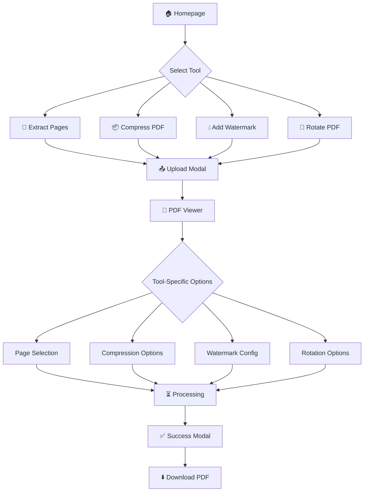

<p align="center">
  
</p>

<h1 align="center">PDF Studio</h1>

<p align="center">
  <strong>Professional PDF tools, elegantly simple.</strong>
</p>

<p align="center">
  <a href="#features">Features</a> •
  <a href="#demo">Demo</a> •
  <a href="#tech-stack">Tech Stack</a> •
  <a href="#installation">Installation</a> •
  <a href="#usage">Usage</a> •
  <a href="#architecture">Architecture</a> •
  <a href="#team">Team</a>
</p>

<p align="center">
  
  
  
  
  
</p>

---

## ✨ Overview

**PDF Studio** by **Eldora Technologies** is a premium, browser-based PDF toolkit that processes files entirely on the client side. No uploads, no servers, no waiting—just instant, secure PDF manipulation with a cinematic user experience.

<p align="center">
  
</p>

---

## 🎯 Features

### 📄 Core PDF Tools

| Tool | Description |
|------|-------------|
| **Extract Pages** | Select and extract specific pages from your PDF into a new file |
| **Compress PDF** | Reduce file size with three quality modes: Optimal, Small File, Lossless |
| **Add Watermark** | Apply custom text watermarks with configurable opacity, rotation, and size |
| **Rotate PDF** | Rotate pages 90° left or right, apply to all or selected pages |

### 🎨 Premium UI Features

- **🌙 Dark/Light Mode** - Toggle between cinematic dark theme and clean light mode
- **✨ Particle Background** - 50+ animated floating particles in dark mode
- **🔮 Glassmorphism** - Frosted glass modals with backdrop blur
- **🎬 Smooth Animations** - 60fps transitions powered by Framer Motion
- **📱 Fully Responsive** - Optimized for desktop, tablet, and mobile

### 📖 PDF Viewer

- Interactive zoom controls (zoom in/out, fit to width/page)
- Page navigation with keyboard shortcuts
- Thumbnail bar with 3D tilt effects
- Custom scrollbar styling
- Animated page transitions

<p align="center">
  
</p>

---

## 🎬 Demo

### Tool Cards
<p align="center">
  
</p>

### Upload Modal
<p align="center">
  
</p>

### Watermark Configuration
<p align="center">
  
</p>

### About Eldora Modal
<p align="center">
  
</p>

### Light Mode
<p align="center">
  
</p>

---

## 🛠 Tech Stack

### Frontend Framework
| Technology | Purpose |
|------------|---------|
| **React 18** | UI component library with concurrent features |
| **TypeScript** | Type-safe JavaScript for robust development |
| **Vite** | Lightning-fast build tool and dev server |

### Styling & Animation
| Technology | Purpose |
|------------|---------|
| **Tailwind CSS** | Utility-first CSS framework |
| **Framer Motion** | Production-ready motion library for React |
| **tailwindcss-animate** | Animation utilities for Tailwind |

### PDF Processing
| Technology | Purpose |
|------------|---------|
| **pdf-lib** | Create and modify PDF documents |
| **pdfjs-dist** | Mozilla's PDF rendering engine |
| **react-pdf** | React components for PDF display |

### State Management
| Technology | Purpose |
|------------|---------|
| **Zustand** | Lightweight state management |
| **localStorage** | Theme persistence |

### UI Components
| Technology | Purpose |
|------------|---------|
| **shadcn/ui** | High-quality, accessible components |
| **Radix UI** | Unstyled, accessible primitives |
| **Lucide React** | Beautiful icon set |

---

## 📁 Project Structure

```
pdf-studio/
├── docs/
│   └── screenshots/          # Project screenshots
├── public/
│   ├── favicon.ico
│   └── robots.txt
├── src/
│   ├── components/
│   │   ├── modals/           # Modal components
│   │   │   ├── AboutModal.tsx
│   │   │   ├── CompressOptionsModal.tsx
│   │   │   ├── ErrorModal.tsx
│   │   │   ├── Modal.tsx
│   │   │   ├── PageSelectModal.tsx
│   │   │   ├── ProgressModal.tsx
│   │   │   ├── RotateModal.tsx
│   │   │   ├── SuccessModal.tsx
│   │   │   ├── UploadModal.tsx
│   │   │   └── WatermarkModal.tsx
│   │   ├── PDFViewer/        # PDF viewer components
│   │   │   ├── PDFViewer.tsx
│   │   │   ├── ThumbnailBar.tsx
│   │   │   └── index.ts
│   │   ├── ui/               # shadcn/ui components
│   │   ├── Footer.tsx
│   │   ├── Header.tsx
│   │   ├── Logo.tsx
│   │   ├── ModalController.tsx
│   │   ├── ParticleBackground.tsx
│   │   ├── ThemeToggle.tsx
│   │   └── ToolCard.tsx
│   ├── hooks/
│   │   └── use-mobile.tsx
│   ├── lib/
│   │   ├── pdfUtils.ts       # PDF processing utilities
│   │   └── utils.ts
│   ├── pages/
│   │   ├── Index.tsx         # Main application page
│   │   └── NotFound.tsx
│   ├── stores/
│   │   ├── modalStore.ts     # Modal state management
│   │   └── themeStore.ts     # Theme state management
│   ├── App.tsx
│   ├── index.css             # Global styles & design tokens
│   └── main.tsx
├── index.html
├── tailwind.config.ts        # Tailwind configuration
├── vite.config.ts
└── package.json
```

---

## 🚀 Installation

### Prerequisites

- **Node.js** >= 18.0.0
- **npm** >= 9.0.0 or **bun** >= 1.0.0

### Quick Start

```bash
# Clone the repository
git clone https://github.com/eldora-technologies/pdf-studio.git

# Navigate to project directory
cd pdf-studio

# Install dependencies
npm install

# Start development server
npm run dev
```

The application will be available at `http://localhost:5173`

### Build for Production

```bash
# Create optimized production build
npm run build

# Preview production build locally
npm run preview
```

---

## 📖 Usage

### End-to-End User Flow



### Tool Workflows

#### 1. Extract Pages
```
Click "Extract Pages" → Upload PDF → View in PDF Viewer → 
Select Pages (click or range input) → Confirm → Download
```

#### 2. Compress PDF
```
Click "Compress PDF" → Upload PDF → Choose Quality Mode 
(Optimal/Small File/Lossless) → Process → View Size Reduction → Download
```

#### 3. Add Watermark
```
Click "Add Watermark" → Upload PDF → Configure Watermark 
(text, size, opacity, rotation) → Preview → Apply → Download
```

#### 4. Rotate PDF
```
Click "Rotate PDF" → Upload PDF → Choose Direction (Left 90°/Right 90°) → 
Select Scope (All/Selected Pages) → Process → Download
```

### Keyboard Shortcuts

| Shortcut | Action |
|----------|--------|
| `←` `→` | Navigate pages in PDF viewer |
| `+` `-` | Zoom in/out |
| `Esc` | Close modal |
| `Enter` | Confirm action |

---

## 🏗 Architecture

### Modal-First UX Pattern

PDF Studio implements a **modal-driven architecture** where all user interactions flow through guided modal sequences. This creates an Apple-grade user experience with minimal friction.

```
┌─────────────────────────────────────────────────────────┐
│                    MODAL CONTROLLER                      │
├─────────────────────────────────────────────────────────┤
│                                                         │
│   ┌─────────┐  ┌─────────┐  ┌─────────┐  ┌─────────┐   │
│   │ Upload  │  │ Progress│  │ Options │  │ Success │   │
│   │  Modal  │→ │  Modal  │→ │  Modal  │→ │  Modal  │   │
│   └─────────┘  └─────────┘  └─────────┘  └─────────┘   │
│                                                         │
└─────────────────────────────────────────────────────────┘
```

### State Management

```typescript
// Modal Store (Zustand)
interface ModalState {
  modalType: ModalType | null;
  toolType: ToolType | null;
  file: File | null;
  fileData: Uint8Array | null;
  fileName: string;
  pageCount: number;
  // Tool-specific configurations
  selectedPages: number[];
  compressionMode: 'optimal' | 'small' | 'lossless';
  watermarkConfig: WatermarkConfig;
  rotateConfig: RotateConfig;
}
```

### Design System

The application uses a comprehensive design token system defined in `index.css`:

```css
:root {
  /* Eldora Brand Colors */
  --gold: 43 87% 68%;
  --gold-dark: 38 60% 53%;
  
  /* Semantic Tokens */
  --background: 0 0% 98%;
  --foreground: 0 0% 7%;
  --primary: 43 87% 68%;
  --accent: 217 91% 76%;
}

.dark {
  --background: 0 0% 7%;
  --foreground: 0 0% 98%;
  /* Neon accents for dark mode */
  --neon-cyan: 180 100% 50%;
  --neon-emerald: 160 84% 39%;
}
```

---

## 🔒 Privacy & Security

- **100% Client-Side Processing** - Your PDFs never leave your browser
- **No Server Uploads** - All operations performed locally using WebAssembly
- **No Data Collection** - We don't track or store any user data
- **Open Source** - Full transparency in how your files are handled

---

## 🎨 Design Philosophy

PDF Studio follows the **Eldora Design Language**:

| Principle | Implementation |
|-----------|----------------|
| **Perfect Simplicity** | Single-page app, minimal steps, zero clutter |
| **Premium Elegance** | Glassmorphism, soft gradients, smooth shadows |
| **Modal-First UX** | Guided flows through clean modal sequences |
| **Cinematic Dark Theme** | Particle backgrounds, neon glows, 3D effects |

---

## 👥 Team

<p align="center">
  <strong>Eldora Technologies</strong><br>
  <em>"Software crafted with elegance and precision."</em>
</p>

| Name | Role |
|------|------|
| **Aditya** | Founder |
| **Anusha** | Founder |
| **Janardhan** | Founder |
| **Gopala Krishna** | Founder |
| **Subrahmanyam** | Founder |

<p align="center">
  📧 <a href="mailto:eldoraTechnologies@gmail.com">eldoraTechnologies@gmail.com</a>
</p>

---

## 📄 License

This project is licensed under the MIT License - see the [LICENSE](LICENSE) file for details.

---

## 🙏 Acknowledgments

- [pdf-lib](https://pdf-lib.js.org/) - PDF creation and modification
- [Mozilla PDF.js](https://mozilla.github.io/pdf.js/) - PDF rendering engine
- [shadcn/ui](https://ui.shadcn.com/) - Beautiful component library
- [Framer Motion](https://www.framer.com/motion/) - Animation library
- [Tailwind CSS](https://tailwindcss.com/) - CSS framework

---

<p align="center">
  <strong>Crafted with ❤️ by Eldora Technologies</strong>
</p>

<p align="center">
  <a href="https://eldora.dev">Website</a> •
  <a href="https://twitter.com/eldoratech">Twitter</a> •
  <a href="https://linkedin.com/company/eldora-technologies">LinkedIn</a>
</p>
